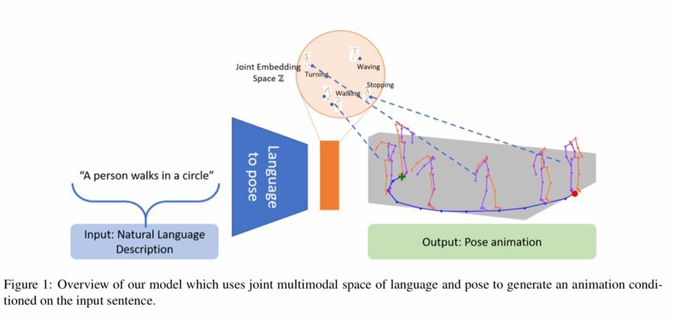
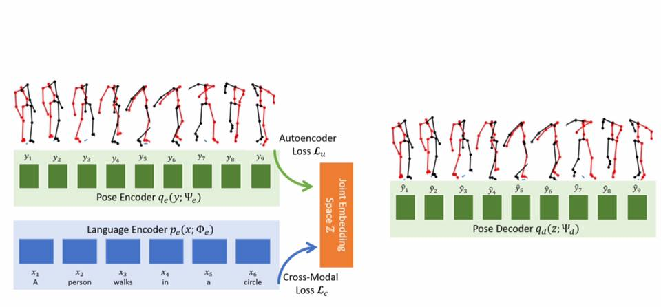
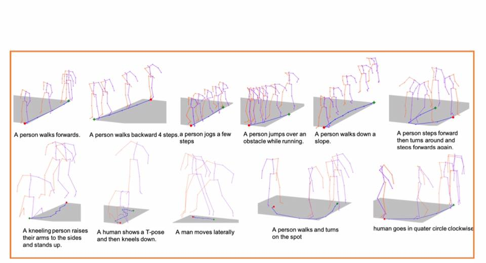

# Joint-Language-to-Pose-JL2P-with-3D-pose

Artificial Intelligence translates words into human animation.

Great work by Chaitanya Ahuja of Language Technologies Institute, Carnegie Mellon University on Joint Language-to-Pose, or JL2P. 

It combines natural language with 3D pose models. Watch how this will help humanoid robots to do physical tasks in the real world.

Read more at https://arxiv.org/pdf/1907.01108.pdf
Watch: https://youtu.be/zfllpcBlAVI
